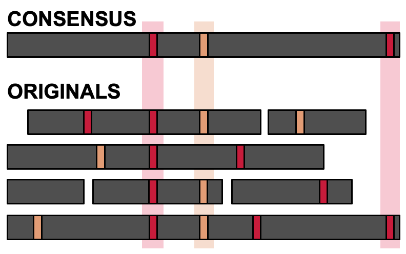

Welcome to the nailpolish documentation.

Nailpolish is a tool written in Rust for error correction of PCR duplicates,
which occur when multiple reads have the same barcode and UMI.
By quickly identifying these duplicates and performing a graph-based
consensus algorithm, Nailpolish can replace these reads with a single
consensus error-corrected read. This process can help to correct some of
the sequencing errors naturally occurring in the reads.

See the [Quick Start](./quickstart.md) for more information.