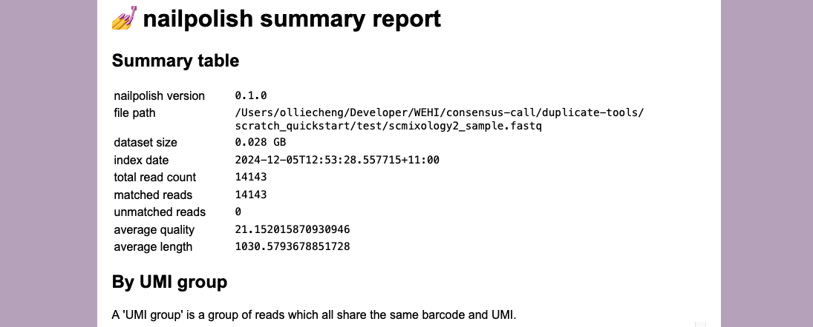

# Quick Start

This quick start guide will walk you through installing Nailpolish and running it on a small demo dataset.
The demo dataset is a small subset of the _scmixology2_ Chromium 10x droplet-based dataset, sequenced using
Nanopore technology, released by [Tian et al. (2021)](https://doi.org/10.1186/s13059-021-02525-6).

Our Flexiplex tool is used to demultiplex the dataset.

## Install

For x64 Linux, run:

```shell
curl --proto '=https' --tlsv1.2 -LsSf "https://github.com/DavidsonGroup/nailpolish/releases/download/nightly_develop/nailpolish" -o nailpolish
chmod +x nailpolish
```

### Get test files

Download the `scmixology2` subset reads using:

```shell
wget https://github.com/DavidsonGroup/nailpolish/releases/download/sample-fastq-for-quickstart/scmixology2_sample.fastq
```

## Indexation

By default, nailpolish expects the barcode and UMI to be in the `@BC_UMI` format at the start of the header.
Alternative barcode and UMI formats can be provided through either a preset (one of `bc-umi`, `umi-tools`, `illumina`)
or a custom barcode regex.

```shell
# write the index file to `index.tsv`
nailpolish index --index index.tsv scmixology2_sample.fastq
```

## Summary of duplicate count

A .html file can be generated to summarise some key statistics about the input reads.

```shell
nailpolish summary index.tsv
```

